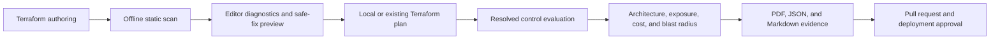

# Azure IaC Guardrail


<p align="center">
  <strong>Review Azure Terraform security, compliance, architecture, and change impact before deployment.</strong>
</p>

<p align="center">
  Azure IaC Guardrail brings local static analysis, resolved plan assurance,
  architecture review, governed exceptions, and audit evidence into Visual
  Studio Code.
</p>


> Azure IaC Guardrail never runs `terraform apply`. Static scans are offline.
> Plan scans use your local Terraform executable and the authentication already
> configured for the selected workspace.

## Why Guardrail

| Author | Review | Govern | Evidence |
|---|---|---|---|
| Detect risky Terraform while editing. | Inspect resolved plans, dependencies, exposure, and blast radius. | Apply shared controls, tags, regions, exclusions, and time-bound exceptions. | Export PDF, JSON, and Markdown artifacts for engineering and assurance workflows. |

## Install

### From a release VSIX

1. Download `azure-iac-guardrail-<version>.vsix` from the approved release.
2. In VS Code, open **Extensions** and select **Views and More Actions (...) > Install from VSIX...**.
3. Select the downloaded package and reload VS Code when prompted.

The same installation can be performed from a terminal:

```powershell
code --install-extension .\azure-iac-guardrail-<version>.vsix
```

For a managed rollout, distribute the approved VSIX through your software
management platform or private extension gallery. Marketplace installation
instructions will be added when the public publisher is configured.

**Requirements**

- Visual Studio Code `1.100.0` or later.
- Terraform only for plan-based workflows.
- Azure/provider authentication only when the selected Terraform workflow
  requires it.

See [Installation and Quick Start](docs/wiki/Installation-and-Quick-Start.md)
for upgrades, uninstalling, and troubleshooting.

## Quick Start

1. Open the folder containing your Terraform root module.
2. Press `Ctrl+Shift+P`.
3. Run **Azure IaC Guardrail: Azure Pre-configuration** and select the Terraform
   root, approved regions, required tags, and any governed exceptions.
4. Run **Azure IaC Guardrail: Scan Terraform Files** for immediate offline
   feedback.
5. Run **Azure IaC Guardrail: Create and Scan Local Terraform Plan** when you
   need resolved values, module instances, relationships, and change impact.
6. Review findings in **Azure IaC Guardrail Results**, apply only reviewed
   fixes, and export the required evidence.

For the complete operating guide, see [USER_GUIDE.md](USER_GUIDE.md).

## Review Pipeline



Static feedback starts in the editor. A Terraform plan adds authoritative
resolved values and relationships. Reviewers then use the same findings,
architecture context, and exported evidence before approving deployment.

## Features

| Feature | Purpose | Guide |
|---|---|---|
| Static Terraform scan | Offline checks with supported variables, tfvars, locals, and modules | [Static Scanning](docs/wiki/Static-Scanning.md) |
| Plan scan | Evaluate resolved resources, relationships, and plan-only controls | [Plan Scanning and Review](docs/wiki/Plan-Scanning-and-Review.md) |
| Editor diagnostics | Problems, hover detail, completions, provenance, and reviewable quick fixes | [Editor Experience](docs/wiki/Editor-Experience.md) |
| Workspace governance | Configure roots, regions, tags, cost assumptions, exclusions, and exceptions | [Workspace Governance](docs/wiki/Workspace-Governance.md) |
| Plan architecture | Search and filter plan topology, risk, actions, and exposure; export SVG | [Plan Scanning and Review](docs/wiki/Plan-Scanning-and-Review.md) |
| Plan comparison and blast radius | Compare plans and summarize connected change impact | [Plan Scanning and Review](docs/wiki/Plan-Scanning-and-Review.md) |
| Resource Cost | Estimate supported retail costs from declared configuration and assumptions | [Resource Cost](docs/wiki/Resource-Cost.md) |
| Cloud Canvas | Design Azure architectures and generate reviewable Terraform | [Cloud Canvas](docs/wiki/Cloud-Canvas.md) |
| Evidence export | Produce a PDF report plus machine-readable JSON and Markdown | [Evidence and Reporting](docs/wiki/Evidence-and-Reporting.md) |

Resource Cost and Cloud Canvas are **Preview** features. Their output requires
human review and is not an Azure bill or deployment approval.

## Scan Modes

| Command | Use it when | Terraform needed |
|---|---|---:|
| **Scan Terraform Files** | You want fast, offline authoring feedback | No |
| **Initialize Modules and Scan Terraform Files** | remote module source has not been downloaded | Yes |
| **Scan Existing Terraform Plan** | CI/CD or another trusted workflow produced a plan | For binary plans |
| **Create and Scan Local Terraform Plan** | You need resolved values, instances, and relationships | Yes |

Generated local plans are temporary by default. Terraform state, plans,
tfvars, backend configuration, credentials, subscription IDs, and tenant IDs
must not be committed.

## Controls and Standards

Built-in service and control definitions live in:

```text
catalog/services/<service-id>.json
```

Each service file owns its Cloud Canvas metadata, Terraform mapping,
parameters, controls, assurances, remediation, and references. The generated
`azure-complete-catalog-vscode.json` is consumed by scanning and Cloud Canvas;
do not edit it directly.

To add or change a standard control:

1. Copy `catalog/service-template.json.example` when adding a service, or open
   the existing service file.
2. Define a unique control ID, exact Terraform resource type and attribute,
   supported operator, expected value, severity, remediation, and authoritative
   reference.
3. Add tests for compliant, non-compliant, and unresolved behavior. Add plan
   and related-resource cases when the control requires them.
4. Run:

   ```powershell
   npm run catalog:validate
   npm run catalog:test
   npm run check
   npm run lint
   npm test
   npm run compile
   ```

5. Commit the service file and regenerated
   `azure-complete-catalog-vscode.json`.

Read [CONTRIBUTING.md](CONTRIBUTING.md) and the
[Control and Standard Contribution Guide](docs/wiki/Contributing.md) before
opening a pull request.

## Develop

```powershell
npm install
npm run check
npm run lint
npm test
npm run compile
```

Press `F5` to launch an Extension Development Host. Maintained Terraform
examples are under `test/fixtures/`, including `storage-spa`,
`three-tier-webapp`, `remote-module-static-scan`, and
`intellisense-ux-demo`.

## Release

Pull requests and pushes to `main` run identifier checks, type checking,
linting, unit tests, compilation, and VSIX packaging. A semantic version tag
(`vX.Y.Z`) builds a checksummed release candidate and publishes it through the
protected Marketplace environment.

Release prerequisites and rollback guidance are documented in
[Release Management](docs/wiki/Release-Management.md) and
[docs/RELEASING.md](docs/RELEASING.md).

## Security and Support

- Report vulnerabilities privately through
  [GitHub Security Advisories](https://github.com/ChendrayanV/Azure-IaC-Guardrail/security/advisories/new).
- Use [GitHub Issues](https://github.com/ChendrayanV/Azure-IaC-Guardrail/issues)
  for defects and feature requests without sensitive data.
- Review [SECURITY.md](SECURITY.md) and
  [Security and Privacy](docs/wiki/Security-and-Privacy.md) before sharing logs
  or evidence.

## License

Released under the [MIT License](LICENSE).
