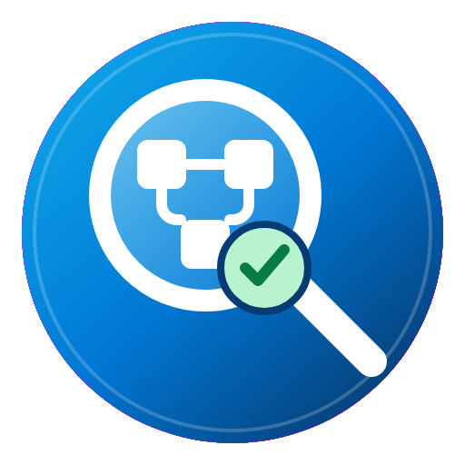
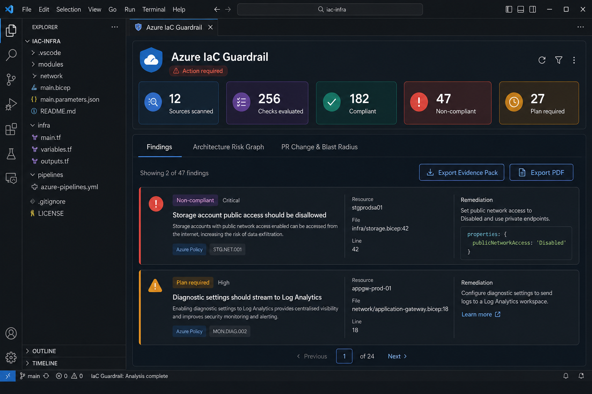

# Azure IaC Guardrail



<h3 align="center">Review Azure Terraform before it reaches production.</h3>

<p align="center">
  Azure IaC Guardrail brings security controls, resolved plan analysis,
  architecture risk, change impact, remediation guidance, and audit evidence
  into Visual Studio Code.
</p>

> Azure IaC Guardrail never runs `terraform apply`. Static scans are offline.
> Plan scans use your local Terraform executable and existing provider/backend
> authentication.

## Product tour



<sub>Illustrative product preview. Resource names and findings are sample data; the shipped extension evaluates Terraform.</sub>


## What you get

<table>
  <tr>
    <td width="33%">
      <strong>Fast authoring feedback</strong><br>
      Resolve variable defaults, automatic and selected tfvars, locals, collections, interpolation, and simple conditionals without invoking Terraform.
    </td>
    <td width="33%">
      <strong>Resolved plan assurance</strong><br>
      Evaluate variables, locals, modules, conditions, and resource relationships from a Terraform plan.
    </td>
    <td width="33%">
      <strong>Actionable findings</strong><br>
      Filter outcomes, inspect observed versus expected values, and open Microsoft or Aqua guidance.
    </td>
  </tr>
  <tr>
    <td>
      <strong>Architecture and blast radius</strong><br>
      Review resource risk, public exposure, creates, updates, replacements, and connected impact.
    </td>
    <td>
      <strong>Workspace governance</strong><br>
      Define required tags, approved exclusions, and time-bound governed exceptions in a visual form.
    </td>
    <td>
      <strong>Audit-ready exports</strong><br>
      Generate a PDF report plus JSON and Markdown evidence artifacts for reviewers and pipelines.
    </td>
  </tr>
</table>

## Quick start

### 1. Open the Terraform root

Open the folder containing the root module's `.tf` files. For nested roots,
open any Terraform file or select a tfvars file located below that root.

### 2. Configure workspace standards

Press `Ctrl+Shift+P` and run:

```text
Azure IaC Guardrail: Azure Pre-configuration
```

Review required tags, add governed exceptions when approved, and save the
profile to `.azure-iac-guardrail/profile.json`.

Pre-configuration also lets teams choose a Terraform `required_version`
constraint for Cloud Canvas generated Terraform. Existing repository
constraints are not rewritten.

### 3. Run the right scan

For immediate offline feedback:

```text
Azure IaC Guardrail: Scan Terraform Files
```

For resolved values and resource relationships:

```text
Azure IaC Guardrail: Create and Scan Local Terraform Plan
```

Choose **Use automatic variable loading** or **Select a .tfvars file**. Local
tfvars files, backend files, plan files, and Terraform state should remain
ignored by Git.

### 4. Review and export

1. Filter **Non-compliant**, **Compliant**, and unresolved results.
2. Review remediation and **Preview Safe Fix** suggestions.
3. Open **Architecture Risk Graph**, **PR Change & Blast Radius**, and
   **Resource Cost** for plan scans.
4. Select **Open Architecture Diagram** for the interactive plan canvas.
5. Select **Export PDF** or **Export Evidence Pack** for review artifacts.
6. Use **Rescan Local Plan** after changing Terraform.

For detailed installation, configuration, troubleshooting, and control
authoring, see the [End-user guide](USER_GUIDE.md).

## Scan modes

| Mode | Best for | Terraform required | Azure authentication |
|---|---|---:|---:|
| **Scan Terraform Files** | Variable-aware offline feedback while editing | No | No |
| **Create and Scan Local Terraform Plan** | Variables, modules, relationships, tags, and change impact | Yes | Depends on the workspace |
| **Scan Existing Terraform Plan** | Plans created in CI/CD or another trusted workflow | For binary plans | No new authentication |

## Plan review experience

- **Architecture Risk Graph** groups Azure resources by risk, exposure, and
  planned action.
- **Open Architecture Diagram** opens a deterministic plan-derived canvas with
  curved dependency connections, labels, dependency-aware layout, zoom, fit,
  pan, connectivity highlighting, change/risk overlays, search, filters,
  resource details, and SVG export.
- **Compare Two Terraform Plans** summarizes added, removed, changed, and
  unchanged resources while reporting changed attribute names without copying
  sensitive plan values.
- **PR Change & Blast Radius** summarizes creates, updates, deletes,
  replacements, connected resources, failed controls, and overall risk.
- **Resource Cost** groups Terraform helper resources under their Azure
  billing parent, prices fixed compute, and estimates Storage from configurable
  monthly capacity and operation assumptions. This feature is currently
  **Preview**.
- **Cloud Canvas · Preview** provides an IDE canvas for Azure service
  cards, directional connections, free panning, keyboard undo/redo and zoom,
  service-specific parameter editing, and reviewable Terraform generation.
  Start from a blank canvas or choose an AKS shared-cluster, three-tier Web
  App, Event Hubs, Event Grid, or Service Bus pattern. Its searchable catalog
  includes more than 200 Azure products and architecture primitives, rendered
  with Microsoft Azure public-service SVG icons where available. A Generic
  Architecture category adds users, developers, architects, devices,
  applications, servers, databases, networks, and other diagram elements.
  Contributors customize one file per service under `catalog/services`. The
  generated `azure-complete-catalog-vscode.json` drives scanning and Canvas.
- **Preview Safe Fix** displays reviewable before/after Terraform snippets and
  never edits files silently.
- **Export Evidence Pack** writes `compliance-report.pdf`, `evidence.json`, and
  `evidence.md`.

## Repository layout

```text
.
|-- src/
|   |-- core/                 # VS Code-independent parser and scanner
|   |-- controls/             # Catalog loading
|   |-- ui/                   # IDE results panel
|   `-- extension.ts          # VS Code activation and scan workflow
|-- azure-infrastructure-standards/
|   |-- schema/               # Control contract
|   |-- controls/             # Domain-based catalogs bundled in the VSIX
|   |-- tests/                # Standards validation guidance
|   |-- CHANGELOG.md
|   `-- VERSION
|-- .azure-iac-guardrail/
|   `-- controls/             # Workspace-specific control overlays
|-- test/
|   |-- unit/                 # Fast scanner tests
|   `-- fixtures/             # Terraform test workspaces
|-- .vscode/                  # F5 launch and build tasks
`-- dist/                     # Generated extension bundle
```

## Develop and test locally

```powershell
npm install
npm run check
npm test
npm run compile
```

Press `F5` in VS Code to launch an Extension Development Host. Open a
Terraform file and run **Azure IaC Guardrail: Scan Terraform Files**. A dedicated
**Azure IaC Guardrail Results** tab opens beside the editor with summary metrics,
finding cards, and remediation guidance. Select a file location in a finding
to jump directly to the affected Terraform line. Saving a Terraform file
refreshes an already-open results tab without stealing focus.

Select **Export PDF** in the results header to create a polished local report
with an executive summary, compliance score, prioritized actions, detailed
findings, and clickable standards references.

## Static and plan scans

The extension supports two complementary scan modes:

- **Scan Terraform Files** evaluates supported top-level attributes and resolves
  variable defaults, automatic and selected tfvars, locals, primitive
  collections, interpolation, simple boolean conditionals, local modules, and
  previously initialized registry or Git modules. It remains offline.
- **Initialize Modules and Scan Terraform Files** runs
  `terraform init -backend=false`, indexes downloaded module source, and then
  performs the static scan. It does not create a plan or initialize a remote
  backend.
- **Scan Existing Terraform Plan** accepts a binary `.tfplan` or JSON produced
  by `terraform show -json`. It checks resolved values, including variables,
  locals, modules, conditionals, and `for_each` instances.
- **Create and Scan Local Terraform Plan** runs `terraform plan` in the selected
  workspace and then scans its resolved JSON. Choose automatic variable loading
  (`terraform.tfvars` and `*.auto.tfvars`) or select a specific `.tfvars` file.

Use **Azure IaC Guardrail: Azure Pre-configuration** to choose the Terraform
root used by all three workflows. Select the folder visually or enter a
workspace-relative path such as `.`, `infra`, or
`test/fixtures/three-tier-webapp`. The path is saved as `terraformRoot` in
`.azure-iac-guardrail/profile.json`. Static scans, module initialization,
variable-file selection, and local plans then use that same root.

Press `Ctrl+Shift+P` and run:

```text
Azure IaC Guardrail: Create and Scan Local Terraform Plan
```

The extension runs `terraform init -input=false` before creating the plan, so
users do not normally need to initialize the workspace manually. Initialization
can download providers, configure the backend, create `.terraform`, and update
`.terraform.lock.hcl`. Set `azureIacGuardrail.initializeBeforePlan` to `false`
when initialization is managed by another workflow.

The generated binary plan is temporary and removed after conversion to JSON.
Set `azureIacGuardrail.retainGeneratedPlan` to `true` to retain the latest plan
at `.azure-iac-guardrail/plans/latest.tfplan`.
Terraform may still contact configured providers and read remote state while
creating the plan. The extension uses `-input=false` and `-lock=false`, and it
never applies infrastructure changes.

To scan a plan generated outside the extension:

```powershell
terraform plan -var-file="dev.tfvars" -out="dev.tfplan"
terraform show -json "dev.tfplan" > "dev.tfplan.json"
```

Use **Scan Existing Terraform Plan** with either `dev.tfplan` or
`dev.tfplan.json`. Configure a non-default executable with
`azureIacGuardrail.terraformPath`.

### Production Terraform fixture

`test/fixtures/production/` is one production-style Terraform root containing
ACR, Storage, Function App, Web App, Key Vault, PostgreSQL, private networking,
managed identity, RBAC, private DNS, and optional diagnostics.

Copy `terraform.tfvars.example` to `terraform.tfvars`, set the subscription and
PostgreSQL Microsoft Entra administrator values, then run **Azure IaC
Guardrail: Scan Terraform Files** or **Create and Scan Local Terraform Plan**.
The defaults use production-capable SKUs and can incur Azure charges.

## Package and distribute

Set a real `publisher` in `package.json`, then create a VSIX:

```powershell
npm run package
code --install-extension .\azure-iac-guardrail-0.1.0.vsix
```

For internal distribution, publish the VSIX as a CI artifact or release asset.
For managed enterprise rollout, publish to a private extension gallery or the
Visual Studio Marketplace and pin approved versions.

## Standards source of truth

The `azure-infrastructure-standards/` directory is the versioned source of
truth for bundled controls:

- `schema/control.schema.json` defines the catalog contract.
- `catalog/services/*.json` owns each service's Canvas, Terraform, control,
  remediation, and icon metadata.
- `VERSION` identifies the immutable standards release.
- `CHANGELOG.md` records control additions and behavioral changes.
- `tests/` documents standards-specific validation.

The extension bundles this reviewed snapshot so scanning works offline.
Workspace overlays in `.azure-iac-guardrail/controls/*.json` remain appropriate
for project-specific rules, experiments, and staged adoption.

The bundled baseline covers enforceable settings for storage, Key Vault,
networking, virtual machines, SQL and open-source databases, Cosmos DB,
Container Registry, AKS, App Service, Functions, messaging, Azure AI services,
Machine Learning, and Log Analytics. It intentionally includes only controls
the current scanner can evaluate from top-level attributes or resolved plan
relationships.

Applicable controls include Aqua Vulnerability Database mappings for App
Service, Container Registry, PostgreSQL, Key Vault, Resource Groups, and
Storage. Result cards link to both Microsoft guidance and the originating Aqua
AVD rule.

Storage private endpoint controls are evaluated from resolved Terraform plan
data because they must match each `azurerm_private_endpoint` to the target
storage account and its `blob`, `file`, `table`, or `queue` subresource. Static
file scans report these controls as requiring a plan.

The storage CMK recommendation applies when a resolved storage account has both
`environment = "production"` and `data_classification = "sensitive"` in its
`tags` map. Azure Storage encryption at rest is recorded as a platform
assurance rather than an executable control because Azure enables it for every
storage account and does not allow it to be disabled.

Legacy `azureCodeGuard.*` and `infraCompliance.*` settings, plus their matching
workspace control folders, remain supported for upgrades from earlier builds.

## Editor IntelliSense and diagnostics

Terraform files receive Azure IaC Guardrail diagnostics in the VS Code Problems
panel after a scan or save. Hover a finding to inspect observed and expected
values, remediation, and tfvars provenance. Quick fixes can rescan, select
static variable files, initialize unresolved modules, or create a resolved
Terraform plan. Completion items are filtered to the enclosing Azure resource
type and offer governed attribute/value pairs from the loaded control catalog.

When a resource value resolves from a selected `.tfvars` file, the same
diagnostic appears on the exact variable assignment with a link back to the
affected resource. Safe scalar corrections offer a preferred **Change value
to...** action. Nested blocks such as `site_config` receive their own relevant
suggestions, and multiple unresolved plan-only checks are summarized rather
than listed separately on the resource declaration.

Run **Azure IaC Guardrail: Select Static Scan Variable Files** to select
environment files. Paths are stored in
`azureIacGuardrail.staticVarFiles`; selected files override Terraform automatic
variable files in selection order.

## Current scanner scope

The source parser handles Terraform `resource` blocks, simple top-level
attributes, variable defaults, tfvars, locals, primitive collections,
interpolation, simple boolean conditionals, nested local modules, and
initialized registry or Git modules. Resolvable module inputs are propagated
to each module instance, and related-resource controls evaluate across the
complete static workspace.

An uninitialized remote module produces an explicit module-source finding with
an **Initialize modules and rescan** quick fix. Modules using `count` or
`for_each` are scanned once from source, but exact instances remain **Plan
required**. Provider functions, data sources, remote state, module outputs,
dynamic blocks, complex comprehensions, and provider-computed values also
remain **Plan required**.

See [Terraform Local Static Scan Scenarios](docs/wiki/Local-Static-Scan-Scenarios.md)
for the complete behavior matrix and the working
`test/fixtures/remote-module-static-scan` registry-module example.

For a visual editor walkthrough, open
`test/fixtures/intellisense-ux-demo`. It demonstrates exact `.tfvars`
diagnostics, nested-block suggestions, plain-language hover help, and
preferred one-click fixes.
