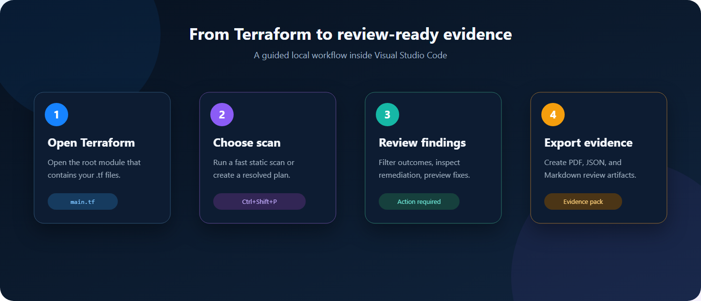

# Azure IaC Guardrail User Guide

Azure IaC Guardrail is a Visual Studio Code extension that evaluates Terraform
resources against versioned Azure infrastructure controls. It supports quick
static checks while authoring and resolved Terraform plan checks before
deployment.

## End-user journey

| Step | Action | Result |
|---|---|---|
| 1 | Open the Terraform root module | The extension can locate `.tf` files and workspace settings. |
| 2 | Run **Azure Pre-configuration** | Required tags, exclusions, and governed exceptions are stored locally. |
| 3 | Run a static or plan scan | Supported controls are evaluated and displayed in the results tab. |
| 4 | Review findings and change impact | Remediation, architecture risk, and blast radius are available in one place. |
| 5 | Export evidence | PDF, JSON, and Markdown artifacts are created for review. |



## 1. Requirements

- Visual Studio Code `1.100.0` or later.
- A workspace containing Terraform `.tf` files.
- Terraform installed and available on `PATH` for plan-based scans.
- Provider and backend credentials required by the selected Terraform
  workspace.

The extension does not apply, modify, or destroy Azure infrastructure.

Release maintainers should follow [docs/RELEASING.md](docs/RELEASING.md) for
Marketplace publisher, token, version, tag, and rollback procedures.

## Azure pre-configuration

1. Open the Terraform root folder in VS Code.
2. The **Azure Pre-configuration** form opens automatically the first time the
   extension is loaded for that workspace.
3. Enter comma-separated approved ARM region names, for example
   `uksouth, ukwest`. The form accepts canonical Azure public-cloud
   programmatic names.
4. Review **Monthly cost assumptions**. The defaults model a small static SPA:
   1 GB stored, 100,000 reads, 10,000 writes, and no paid egress per month.
   Change the currency and usage to match the expected workload.
5. Review the default `environment`, `cost-center`, `owner`, and `deployed-via`
   tags, then enter exact required values where appropriate.
6. Select **Add Tag** to create more rows.
7. Optionally enter comma-separated IDs under **SKIP Scan for Control ID(s)**,
   for example `AZ-AI-003, AZ-AI-004`.
8. Select **Save Azure Pre-configuration**.
9. Commit `.azure-iac-guardrail/profile.json` when the policy should be shared
   by the team.
10. Run **Create and Scan Local Terraform Plan** to evaluate regions and tags
   against resolved values.

Reopen the form with **Azure IaC Guardrail: Azure Pre-configuration** from the
Command Palette. The setup is local and never authenticates to Azure. Skipped
IDs are excluded from both static and local plan scans.

Static scans skip generated tag controls because Terraform source commonly
assigns tags through locals or variables. Plan findings use control IDs
beginning with `ORG-TAG-`. Region violations use
`ORG-REGION-LOCATION` and are non-compliant errors.

## 2. Install the extension

Install a supplied VSIX from a terminal:

```powershell
code --install-extension .\azure-iac-guardrail-0.1.0.vsix
```

Alternatively, in VS Code:

1. Open the **Extensions** view.
2. Select **Views and More Actions**.
3. Select **Install from VSIX**.
4. Select the Azure IaC Guardrail VSIX.

Reload VS Code when prompted.

Open VS Code's **Welcome** page and select
**Get Started with Azure IaC Guardrail** to follow the built-in walkthrough.

## 3. Run a static Terraform scan

Use this mode for fast feedback while editing.

1. Open the Terraform root folder in VS Code.
2. Open the Command Palette with `Ctrl+Shift+P`.
3. Run **Azure IaC Guardrail: Scan Terraform Files**.
4. Review the **Azure IaC Guardrail Results** tab.

The static scanner reads Terraform resource blocks and literal top-level
attributes. Values derived from variables, locals, modules, conditions, or
resource references may appear as **Plan required**.

Static scans are offline and do not invoke Terraform.

## 4. Create and scan a resolved plan

Use this mode to evaluate variables and relationships between resources, such
as storage accounts and private endpoints.

1. Open the Terraform root folder.
2. Open the Command Palette.
3. Run **Azure IaC Guardrail: Create and Scan Local Terraform Plan**.
4. Choose one of the variable options:
   - **Use automatic variable loading** uses `terraform.tfvars` and
     `*.auto.tfvars`.
   - **Select a .tfvars file** passes the selected file to Terraform with
     `-var-file`.
5. Wait for initialization, planning, and scanning to complete.

The results tab displays colored Prepare, Initialize, Create plan, and
Evaluate stages while the command runs. After results appear, select
**Rescan Local Plan** to repeat the scan with the same workspace and variable
file without answering the selection prompts again.

### Architecture and change assurance

Resolved plan scans expose four result views:

- **Findings** lists control outcomes and offers **Preview Safe Fix** when a
  deterministic expected attribute can be suggested. The preview does not
  modify Terraform automatically.
- **Architecture Risk Graph** groups planned Azure resources, inferred
  references, public exposure, change action, and risk.
- **Open Architecture Diagram · Preview** is visible in that view as a
  coming-soon feature. It is intentionally disabled.
- **PR Change & Blast Radius** uses Terraform `resource_changes` to summarize
  creates, updates, deletes, replacements, connected-resource impact, and
  failed-control concentration.
- **Resource Cost** queries the unauthenticated Microsoft Retail Prices API
  for supported fixed hourly resources. VM and VM scale-set estimates consider
  region, size, operating system, zones, and instance count. App Service plan
  estimates consider region, SKU, operating system, zone balancing, and worker
  count. Storage estimates consider region, access tier, replication, planned
  blob content, and the configured monthly capacity and operation assumptions.

The cost view reports an **estimated monthly subtotal**, not a bill. Terraform
resources that do not create a separate Azure charge, including resource
groups, storage static-website configuration, and individual managed blobs,
are hidden or grouped under their billable parent. This avoids duplicate
`Price unavailable` cards.

Fixed compute assumes 730 hours per month. Storage capacity, reads, and writes
use the values saved in Azure Pre-configuration. Egress is displayed as an
assumption but remains a partial estimate when it is non-zero because the
network route and destination cannot be inferred safely. Public retail prices
exclude negotiated discounts, reservations, taxes, and workload behavior not
represented in Terraform.

Run **Azure IaC Guardrail: Analyze PR Change and Blast Radius** to create a
resolved local plan and open these views.

### Cloud Canvas preview

Run **Azure IaC Guardrail: Cloud Canvas (Preview)** from the Command
Palette. The command ID is `sketchyourinfra`.

1. Search the Azure service palette.
2. Drag service cards onto the canvas.
3. Select **Draw Connection**, then select the dependent service followed by
   the service it depends on.
4. Select a card to edit its Azure resource name and region.
5. Select **Save Sketch** to store
   `.azure-iac-guardrail/sketchyourinfra.json`.
6. Select **Preview Terraform** to open generated code beside the canvas.
7. Select **Generate Terraform** and choose the target `.tf` file in the
   selected workspace.

The preview currently supports Resource Groups, Virtual Networks, Subnets,
Storage Accounts, Key Vault, App Service plans, Linux Web Apps, SQL servers,
SQL databases, Container Registry, and Log Analytics. Supported connections
become direct Terraform references where possible. Other connections become
explicit `depends_on` relationships.

Generated code uses secure starting defaults, but it is scaffolding rather
than deployment-ready architecture. Review names, CIDR ranges, SKUs, identity
configuration, private endpoints, DNS, and organization-specific modules
before running a Terraform plan.

### Governed exceptions

Open **Azure IaC Guardrail: Azure Pre-configuration** and select **Add Governed
Exception**. Each exception requires:

- control ID;
- owner;
- expiry date; and
- business justification.

A ticket is optional. Active exceptions suppress the matching control.
Expired exceptions remain recorded as evidence but no longer suppress scans.

### Auditor evidence packs

Select **Export Evidence Pack** in results or run **Azure IaC Guardrail: Export
Auditor Evidence Pack**. Choose a destination folder. The extension creates:

- `compliance-report.pdf` for quick review;
- `evidence.json` for audit tooling and pipelines; and
- `evidence.md` for repositories, pull requests, and review records.

The pack includes outcomes, observed and expected values, references,
architecture risk, blast radius, tag policy, direct skips, and governed
exception status.

By default, the extension runs:

```text
terraform init -input=false -no-color
terraform plan -input=false -lock=false -no-color -out=<temporary-plan>
terraform show -json <temporary-plan>
```

The binary plan is stored temporarily in VS Code extension storage and deleted
after conversion to JSON. Plan JSON is processed in memory and is not retained
by the extension.

Set `azureIacGuardrail.retainGeneratedPlan` to `true` to keep the latest plan
at `.azure-iac-guardrail/plans/latest.tfplan`. The folder is ignored by Git.
Treat retained plans as sensitive.

Terraform can contact providers, read remote state, download plugins, create
`.terraform`, and update `.terraform.lock.hcl`. It never runs `terraform apply`.

## 5. Scan an existing plan

Use this mode when a plan is created by another workflow or must be retained for
review.

Create a binary plan:

```powershell
terraform plan -var-file="production.tfvars" -out="production.tfplan"
```

Optionally convert it to JSON:

```powershell
terraform show -json "production.tfplan" > "production.tfplan.json"
```

Then:

1. Run **Azure IaC Guardrail: Scan Existing Terraform Plan**.
2. Select the `.tfplan` or plan JSON file.
3. Review the results.

Treat plan files as sensitive. They can contain resource attributes, identifiers,
configuration values, and values derived from secrets.

## 6. Understand the results

The results header reports the overall status:

- **Compliant**: all evaluated controls passed.
- **Action required**: one or more controls are non-compliant.
- **Plan required**: no failure was found, but one or more checks need resolved
  Terraform plan data.

Each control result has one of these states:

- **Compliant**: the observed value satisfies the control.
- **Non-compliant**: the observed value violates the control. Follow the
  remediation shown on the result card.
- **Plan required**: the static scanner cannot safely determine the result.
  Run a plan-based scan.

Use **All**, **Non-compliant**, **Compliant**, and **Plan required** to filter
the result cards. For static findings, select the file and line link to open the
affected Terraform source.

Select **Microsoft guidance** on any result card to open the control's
authoritative Microsoft Learn reference in your browser.

Controls mapped from the Aqua Vulnerability Database also show an
**Aqua AVD rule** link to the originating benchmark check.

## 7. Export a PDF report

After any successful scan, select **Export PDF** in the results header or run
**Azure IaC Guardrail: Export Scan Results as PDF** from the Command Palette.

The report is designed for quick evaluation and includes:

- Overall compliance status and score.
- Error, warning, compliant, and unresolved totals.
- A prioritized remediation list.
- Affected Azure service families.
- Detailed non-compliant and apply-time findings.
- Clickable Microsoft Learn and Aqua AVD references.

The PDF is generated locally from the in-memory scan results. Review the
destination carefully because observed Terraform values and resource names may
be sensitive.

## 8. Scan on save

Static scanning on save is enabled by default. It runs only for saved `.tf`
documents and refreshes an existing results tab without opening a new tab.

Disable it in workspace settings:

```json
{
  "azureIacGuardrail.scanOnSave": false
}
```

## 9. Extension settings

| Setting | Default | Purpose |
|---|---|---|
| `azureIacGuardrail.scanOnSave` | `true` | Runs a static scan when a `.tf` file is saved. |
| `azureIacGuardrail.workspaceControlsPath` | `.azure-iac-guardrail/controls` | Workspace-relative directory containing additional control catalogs. |
| `azureIacGuardrail.terraformPath` | `terraform` | Terraform executable name or absolute path. |
| `azureIacGuardrail.initializeBeforePlan` | `true` | Runs `terraform init` before creating a local plan. |
| `azureIacGuardrail.retainGeneratedPlan` | `false` | Keeps the latest generated plan in `.azure-iac-guardrail/plans/`. |

Example configuration:

```json
{
  "azureIacGuardrail.scanOnSave": true,
  "azureIacGuardrail.terraformPath": "C:\\Tools\\Terraform\\terraform.exe",
  "azureIacGuardrail.initializeBeforePlan": false,
  "azureIacGuardrail.retainGeneratedPlan": true
}
```

Disable initialization only when the workspace is initialized by another
trusted process.

## 10. Built-in standards

Bundled standards are stored by domain under:

```text
azure-infrastructure-standards/controls/
```

The bundled catalogs cover security-relevant settings for storage, Key Vault,
networking, virtual machines, SQL and open-source databases, Cosmos DB,
Container Registry, AKS, App Service, Functions, Service Bus, Event Hubs,
Azure AI services, Machine Learning, and Log Analytics.

The baseline evaluates controls that the current engine can determine from
top-level Terraform resource attributes and resolved plan values. Requirements
that need numeric ranges, collection membership, arbitrary cross-resource
queries, or nested-block semantics are not represented until the scanner
supports those operators.

Private endpoint checks require a resolved plan because the extension must
match endpoint resource IDs and storage subresources.

The customer-managed-key recommendation applies when the storage account has:

```hcl
tags = {
  environment         = "production"
  data_classification = "sensitive"
}
```

Azure Storage encryption at rest is recorded as a platform assurance because
Azure enables it for all storage accounts and does not allow it to be disabled.

## 11. Add workspace-specific controls

Place JSON catalogs in:

```text
.azure-iac-guardrail/controls/
```

The extension loads these catalogs in addition to bundled standards. Start from
`.azure-iac-guardrail/controls/example.json` and validate the structure against:

```text
azure-infrastructure-standards/schema/control.schema.json
```

Control IDs must be unique. Supported operators are:

- `equals`
- `notEquals`
- `exists`
- `relatedResourceExists`

Use workspace controls for project-specific requirements. Changes to shared
organizational policy should be reviewed and versioned in the standards
catalog.

## 11. Troubleshooting

### Terraform executable was not found

Confirm `terraform version` works in a terminal, or set
`azureIacGuardrail.terraformPath` to the executable's absolute path.

### Terraform initialization or planning failed

Run `terraform init` and `terraform plan` in the workspace terminal to inspect
the full provider, backend, authentication, or configuration error. Resolve the
Terraform error before running the extension command again.

### A check says Plan required

The value is computed or the control depends on relationships between resources.
Run **Create and Scan Local Terraform Plan** or scan an existing plan.

### A plan scan says Apply-time value

**Apply-time value is not a compliance failure.** It means Terraform completed
the plan, but the AzureRM provider could not supply one attribute until Azure
creates or updates the resource. Azure IaC Guardrail does not guess, so that
specific control remains unresolved.

For required related resources, the extension still fails what it can prove is
missing. For example:

- no storage private endpoints in the plan: blob, file, table, and queue
  controls are **Non-compliant**;
- only a blob endpoint exists: file, table, and queue controls are
  **Non-compliant**;
- a blob endpoint exists, but its target storage ID is still unknown:
  the blob relationship alone can remain **Apply-time value** until Terraform
  can prove which storage account it targets.

This differs from **Plan required**:

| Result | Meaning | Next action |
|---|---|---|
| **Plan required** | A static source scan needs evaluated Terraform values. | Run a plan scan with the intended tfvars file. |
| **Apply-time value** | A plan was scanned, but Terraform still marked the value as `known after apply`. | Review the planned dependency and verify it after deployment or in a later plan. |

#### Example: storage account and private endpoint

Consider a new storage account and private endpoint:

```hcl
resource "azurerm_storage_account" "app" {
  name                     = var.storage_account_name
  resource_group_name      = azurerm_resource_group.app.name
  location                 = azurerm_resource_group.app.location
  account_tier             = "Standard"
  account_replication_type = "LRS"
}

resource "azurerm_private_endpoint" "blob" {
  name                = "pe-storage-blob"
  resource_group_name = azurerm_resource_group.app.name
  location            = azurerm_resource_group.app.location
  subnet_id           = var.private_endpoint_subnet_id

  private_service_connection {
    name                           = "storage-blob"
    private_connection_resource_id = azurerm_storage_account.app.id
    subresource_names              = ["blob"]
    is_manual_connection           = false
  }
}
```

Before the storage account exists, its final Azure resource ID may be marked
`known after apply`. Terraform understands the dependency, but the JSON plan
may not contain the final value needed by a cross-resource compliance check.
The extension reports **Apply-time value** instead of incorrectly marking the
private endpoint compliant or non-compliant.

Recommended response:

1. Confirm the Terraform reference points to the intended resource.
2. Review the planned resource type, subresource, network settings, and
   dependency.
3. Apply only through your normal approved deployment process.
4. Verify the deployed Azure configuration or scan a later plan after the
   referenced resource exists.

Running the same unchanged pre-deployment plan usually does not resolve the
value. Other common examples include new managed identity principal IDs, Key
Vault key versions, diagnostic-setting target IDs, and generated service
endpoints.

### The wrong variable values were scanned

Use **Select a .tfvars file** and choose the intended environment file. Automatic
loading only includes Terraform's standard `terraform.tfvars` and
`*.auto.tfvars` files.

### No applicable controls are shown

The scan did not find a Terraform resource type covered by the loaded catalogs.
Confirm the correct workspace is open and that workspace control files are in
the configured controls directory.

### A custom catalog is rejected

Check that the file is valid JSON and contains both `catalogVersion` and a
`controls` array. Compare it with the bundled schema and example catalog.

## 12. Recommended workflow

1. Keep scan on save enabled for immediate static feedback.
2. Resolve all clear non-compliant findings during development.
3. Run a resolved plan scan with the intended environment variables.
4. Review every non-compliant and plan-required result.
5. Retain an externally generated plan only when required by the deployment or
   approval process.
6. Apply infrastructure only through the organization's approved delivery
   workflow.
